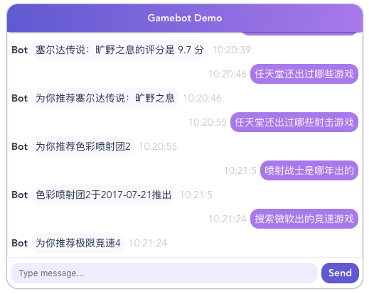

# Gamebot

用 Vue.js 编写的一个用来演示 NLU（自然语言理解） 能力 和 游戏库查询功能的 Demo。

代码写的很烂，请求链条是在两个 HTTP 异步回调里完成的。鉴于我自己也不是专业的前端，也没写过 Vue.js，嗯，等以后知道了规范的写法之后，再考虑优化吧。目前注意力主要集中在**两个后端服务的改造**上。



下面这两个后端服务在我另外两个 Git Project 上，可以通过 docker 部署在本机自测，或者部署到 K8s 平台上（计划）。

NLU 和 游戏库 两个后端服务的格式：

```bash
# API for NLU
Request: HTTP GET http://localhost:5005/parse?q=搜索任天堂出的射击游戏
Response:
{
  "intent": {
    "name": "game_recommend",
    "confidence": 0.4798265664356213
  },
  "entities": [
    {
      "entity": "company",
      "value": "任天堂",
      "start": 2,
      "end": 5,
      "confidence": null,
      "extractor": "ner_mitie"
    },
    {
      "entity": "type",
      "value": "射击",
      "start": 7,
      "end": 9,
      "confidence": null,
      "extractor": "ner_mitie"
    }
  ],
  "text": "搜索任天堂出的射击游戏"
}

# API for GameSet Query
Request: HTTP POST http://127.0.0.1:5010/gamesearch
Request Body: 
{
  "query": {
    "name": "塞尔达",
    "company": "任天堂",
    "score": 9.5,
    "platform": "switch"
  }
}
Response:s
{
    "games": [
        {
            "name": "塞尔达传说：旷野之息",
            "nickname": "The Legend of Zelda：Breath of the Wild",
            "score": 9.7,
            "pop": 9715,
            "date": "2017-03-03",
            "company": "任天堂",
            "platform": "['WiiU', 'switch']",
            "url": "https://www.vgtime.com/game/805.jhtml",
            "img": "https://img01.vgtime.com/photo/web/160616170441201.jpg"
        }
    ]
}
```


## 食用方法

``` bash
# install dependencies
npm install

# serve with hot reload at localhost:8080
npm run dev

# build for production with minification
npm run build

# build for production and view the bundle analyzer report
npm run build --report
```
